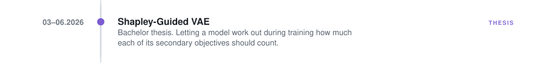
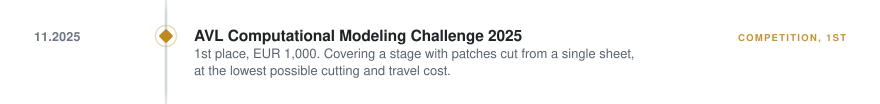
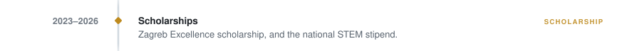

# Roko Čubrić

MSc Computer Science at ETH Zürich from September 2026. 
Machine Intelligence major, Theoretical Computer Science minor.

<a href="https://www.linkedin.com/in/roko-cubric/">LinkedIn</a>

 

<picture><source media="(prefers-color-scheme: dark)" srcset="assets/timeline/00-eth-dark.svg"></picture>
<a href="#cern-summer-student"><picture><source media="(prefers-color-scheme: dark)" srcset="assets/timeline/01-cern-dark.svg"></picture></a>
<picture><source media="(prefers-color-scheme: dark)" srcset="assets/timeline/02-bsc-dark.svg"></picture>
<a href="#shapley-guided-vae"><picture><source media="(prefers-color-scheme: dark)" srcset="assets/timeline/03-thesis-dark.svg"></picture></a>
<a href="#stem-games-2026-mathematics-arena"><picture><source media="(prefers-color-scheme: dark)" srcset="assets/timeline/04-stem26-dark.svg"></picture></a>
<a href="#avl-computational-modeling-challenge-2025"><picture><source media="(prefers-color-scheme: dark)" srcset="assets/timeline/05-cmc25-dark.svg"></picture></a>
<a href="#gaussvae"><picture><source media="(prefers-color-scheme: dark)" srcset="assets/timeline/06-gaussvae-dark.svg"></picture></a>
<a href="#abysalto-ai-agent-factory"><picture><source media="(prefers-color-scheme: dark)" srcset="assets/timeline/07-abysalto-dark.svg"></picture></a>
<a href="#stem-games-2025-mathematics-arena"><picture><source media="(prefers-color-scheme: dark)" srcset="assets/timeline/08-stem25-dark.svg"></picture></a>
<picture><source media="(prefers-color-scheme: dark)" srcset="assets/timeline/09-loncar-dark.svg"></picture>
<a href="#computational-modeling-challenge-2024"><picture><source media="(prefers-color-scheme: dark)" srcset="assets/timeline/10-cmc24-dark.svg"></picture></a>
<picture><source media="(prefers-color-scheme: dark)" srcset="assets/timeline/11-scholarships-dark.svg"></picture>
<picture><source media="(prefers-color-scheme: dark)" srcset="assets/timeline/12-fer-start-dark.svg"></picture>

Entries with a project behind them link to the write-up below.

---

## In detail

### CERN, Summer Student

Summer 2026

Summer Student at CERN in Geneva.

<!-- TODO Roko: expand once you can describe the work publicly.
     Match the register of the entries below: what the problem was, what you built,
     and the limitation. Three to five sentences is enough. Then add a badge row. -->

 

### Shapley-Guided VAE

03–06.2026 · Bachelor thesis · <a href="https://github.com/roko-cubric/shapley-guided-vae">roko-cubric/shapley-guided-vae</a>

A model trained on several objectives needs a rule for how much each objective counts. That rule is normally a set of constants found by grid search and then held fixed for the rest of the run, which assumes the split that is right early in training is still right late in it. I estimated it during training instead. The auxiliary tasks are treated as players in a cooperative game, and their Shapley values distribute a fixed budget across the loss terms. The estimates stay cheap because uncertain coalitions get sampled more often and old measurements are discounted as the network moves underneath them.

All three variants beat static uniform weighting, for under 10% added training time. The effect is real and small. The honest result sits underneath it: a model with no auxiliary tasks at all still reconstructs best, which is the capacity trade-off multi-task learning is known for. The experiments show the mechanism can be built and estimated stably during training, not that it pays.

 

### STEM Games 2026, Mathematics Arena

05.2026 · team ReinFERcement learning · <a href="https://github.com/roko-cubric/STEM-Games-M-2026">roko-cubric/STEM-Games-M-2026</a>

Bot detection normally works at the account level, on post counts, follower ratios and account age. This system uses none of those. The only input is one Reddit comment and the way it is written, and the output is a probability that this particular comment is AI-generated rather than a claim about who owns the account. Three subsystems read the same comment along a semantic, a structural and a lexical axis, and a stacking meta-model learns how to combine what they report.

The combined model reaches **98.4% accuracy** on the held-out test set, and beats every individual subsystem by more on calibration than on accuracy. The corpus is the real limitation: most of the AI examples come from a narrow family of generators, so that number describes this distribution rather than the open web. The Chrome extension we delivered also serves only one of the three subsystems.

 

### AVL Computational Modeling Challenge 2025

11.2025 · 1st place, EUR 1,000 · sponsored by AVL-AST · <a href="https://github.com/roko-cubric/cmc25">roko-cubric/cmc25</a>

Stains on a stage have to be covered by patches cut from a single square sheet, at a cost combining the cutting perimeter and the distance travelled between the cutting area and each final position. I designed a small set of reusable patch shapes by hand, picked a configuration that already scored well, then fine-tuned the position and rotation of each patch with a Monte Carlo local search that samples candidates, keeps the best valid ones and tightens around them.

Most of the gain came from the manual geometry. The search only polished the parameters.

 

### GaussVAE

10.2025–02.2026 · <a href="https://github.com/roko-cubric/GaussVAE-showcase">roko-cubric/GaussVAE-showcase</a>

Image compression through the Gaussian parameters rather than the pixels. Image-GS represents an image as a set of 2D Gaussian splats, and the idea was to compress those parameters instead of the pixel grid. Morton Z-order sorting linearises the splats first, so the 1D convolutions have local spatial structure to find.

Position and scale converge. Rotation and colour do not, and scaling the decoder up did not fix it. My hypothesis was that the decoder is the bottleneck, but the deeper flaw is running an autoencoder over an input that is fundamentally a set: mapping a latent vector back to a set of parameters with complex interdependencies stays hard even with Morton ordering. I paused the project in January 2026 and moved the underlying question to my thesis.

 

### Abysalto, AI Agent Factory

Summer 2025 · <a href="https://github.com/roko-cubric/AI-Agent-RAG-Platform">roko-cubric/AI-Agent-RAG-Platform</a>

AI Academy internship on a platform for building and deploying document-processing agents. I worked on architecture and implementation. I pushed for the Strategy pattern so that retrieval methods, chunking methods and evaluation could be swapped without touching the services around them, and built several of the retrieval methods, among them multi-query expansion, hybrid semantic and keyword search, and a graph walk over related chunks. Documents carry separate embeddings for their content, their summary and the questions they could answer, so a query can match on more than surface text. I wrote the FastAPI services and the PostgreSQL and pgvector layer, including table generation that adapts to the dimension of whichever embedding model is selected.

The source is proprietary to Abysalto. The repository documents the architecture and my part in it rather than shipping the code.

 

### STEM Games 2025, Mathematics Arena

05.2025 · 1st place · <a href="https://github.com/roko-cubric/Stem-Games-2025">roko-cubric/Stem-Games-2025</a>

Theory and programming on information theory and error-correcting codes. The main task was protecting a 100-bit message on a channel that flips up to 10 bits at random. We split the message into blocks and covered each with the strongest code that fits it, then precomputed the full syndrome table, so correcting a block is a dictionary lookup rather than a search.

A second task capped the protection at exactly 20 extra bits. We laid the message out as a grid and took parities along two different directions, so a single error trips one check in each and the intersection locates it.

 

### Computational Modeling Challenge 2024

11.2024 · <a href="https://github.com/roko-cubric/cmc24">roko-cubric/cmc24</a>

One ray of light enters a dark 2D room and eight mirrors have to be placed to illuminate as much of it as possible. I wrote a tree-based evolutionary algorithm that grows the mirror set one at a time, scores candidates on covered area and a positional heuristic, keeps the best two and branches each into two more. A rearrangement pass over adjacent pairs afterwards tunes the angles.

The emphasis was on getting a working algorithm inside the competition deadline, not on code that survives maintenance.

---

Zürich, from September 2026 · <a href="https://www.linkedin.com/in/roko-cubric/">LinkedIn</a>

